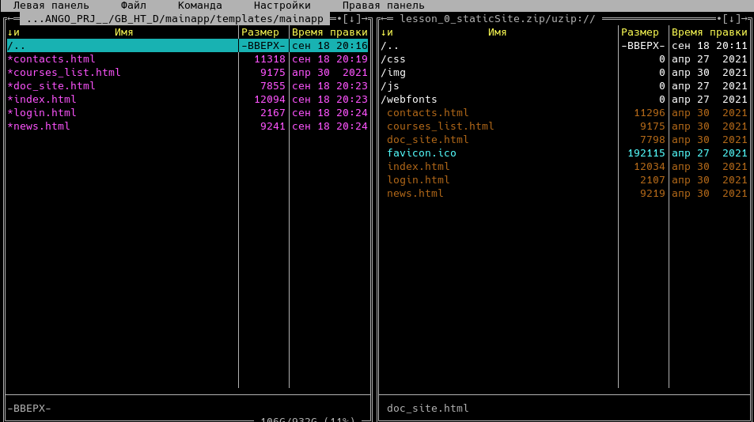

# Home Work 2

## 1. Создайте репозиторий на GitHub

Клонируйте и подготовьте локальный репозиторий проекта.
Для этого создайте файл исключений,
добавьте файл лицензии и вложите файл описания проекта.
Создайте ветку для урока.

---

Для создание проекта на GitHub будем использовать
[githubcli](https://cli.github.com)


Добавим README.md


Создадим новую ветку(локально)


Url проекта [https://github.com/ISVios/GB_HT_D/tree/develop_1]

---

## 2. Работа с проектом

Установите Django.
Создайте проект и приложение в главной папке проекта.
Перенесите статичный сайт в проект, вложив его в созданное приложение.
Скорректируйте файлы вёрстки для корректной загрузки статических файлов.

---

Установка django в python venv


Создание проекта


Создание приложение(app)


Тестовый запуск

```bash
python manage.py runserver
```


Добавим проект из первого урока

создадим папку static и скопируем все статичные
файлы(стили, скрипты, изображения)


создадим путь **/templates/mainapp/** для **html** файлов



для каждого **html-файла** исправим пути с:

- **/css/...** --> **/static/css/...**
- **/js/...** --> **/static/js/...**
- **/img/...** --> **/static/img/...**

Создадим для каждой странице обработчик(view)


И пропишем пути в **mainapp/urls.py**


Зарегистрируем приложение **mainapp** в проекте


Тест


---

## 3. Подключите <s>VS Code</s> IDE к проекту

---

В качестве IDE используется программиуемый текстовый редактор
[vim](https://ru.wikipedia.org/wiki/Vim),
точнее его ответвление [neovim](https://neovim.io) c расширением
[coc](https://github.com/neoclide/coc.nvim)(coc-pyright, coc-python)
и [Floaterm](https://github.com/voldikss/vim-floaterm)


для горячих клавиш(запуска)
допишем конфигурацию для vim

```vimscript
nmap <silent> <leader>jr :FloatermNew hm=$(git rev-parse --show-toplevel); python "$hm/manage.py" runserver<cr>
```

при нажатии "\ j r"


---

## 4. (*) Разберитесь, почему не работают ссылки в проекте
Ответ приложите в комментарии к сдаче практического задания.

---

Cсылки неработают так, как ссылаются на <путь>.html

Решение:

заменить в ссылках **<путь>.html** на **<путь>/**

---

## 5. <s>Подключите к проекту PyCharm Community</s>

---

Использую Vim

---

## 6. <s>Запросите в техподдержке ключ</s>
на возможность использования PyCharm Professional,
установите и подключите к проекту.

---

Использую Vim

---

## 7. (**) Подключите VS Code, работающий на хостовой машине
к папке проекта на виртуальной машине через протокол SSH.

---

Создадим ssh ключи

```bash
ssh-keygen
Generating public/private rsa key pair.
Enter file in which to save the key (/home/ /.ssh/id_rsa): /home/ /.ssh/virt
Enter passphrase (empty for no passphrase):
Enter same passphrase again:
Your identification has been saved in /home/ /.ssh/virt
Your public key has been saved in /home/ /.ssh/virt.pub
The key fingerprint is:
SHA256:gZXMO5drpYC+FL6CvZKOge7WL3ueVdRXVH/ZAj2KLyA
The key's randomart image is:
+---[RSA 3072]----+
|       o..  ...oo|
|       o+ .  .+ +|
|      ...o + o.o+|
|      E *.+ +  ..|
|     o oS* =     |
|.     + . = .    |
|o .+ . + . .     |
|.++oo.=          |
|++.oB*           |
+----[SHA256]-----+
```

Отправим публичный ключ на сервер

```bash
ssh-copy-id -i ~/.ssh/virt.pub virt@192.168.100.232
```

Подключаемся через
[mc](http://rus-linux.net/MyLDP/consol/midnight-commander.html)


Такой подход имеет минусы

- для навигации используется мс
- плагины vim могут не корректно работать

## Второй подход подключаем удаленный сервер как диск

используя [sshfs](https://ru.wikipedia.org/wiki/SSHFS) подкючим папку проекта
к локальной

```bash
sshfs virt@192.168.100.232:/home/virt/djangoBasics/ -p 22 virt
cd virt
conf  db.sqlite3  LICENSE  mainapp  manage.py  README.md  static  templates  www-env
```

Для отключния(размонтировния) папки от сервера

```bash
fusermount -zu virt
```

---
